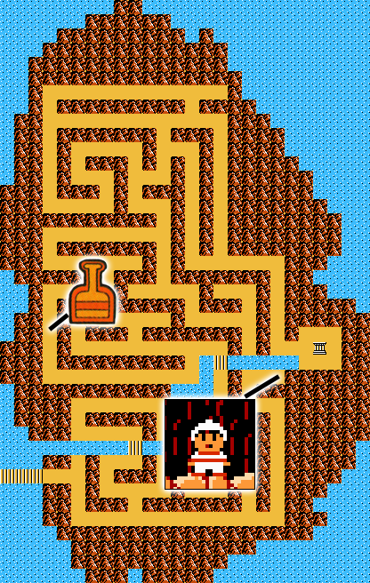
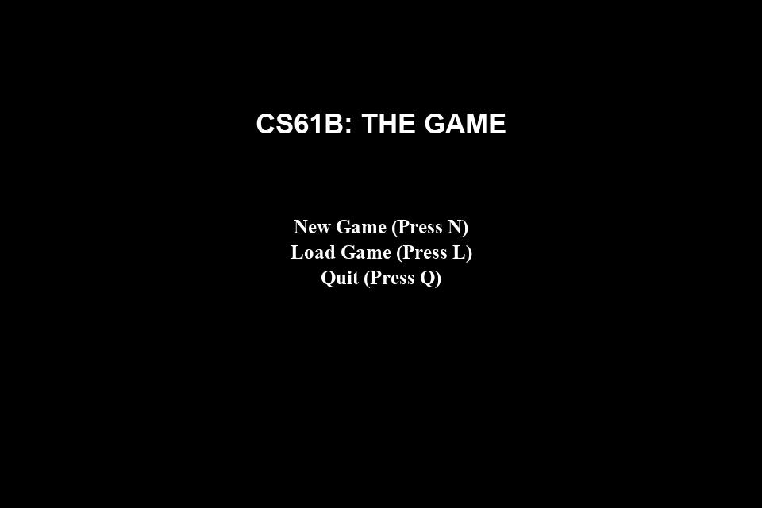
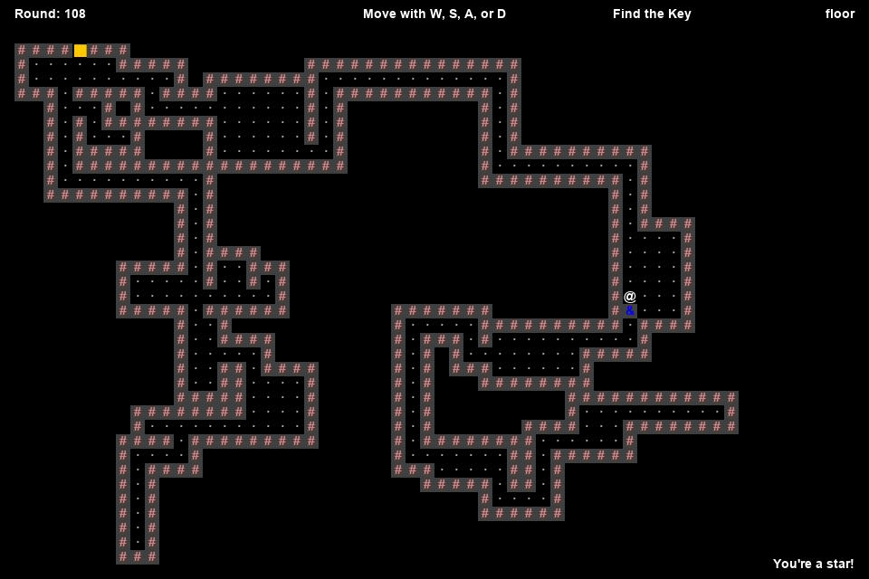
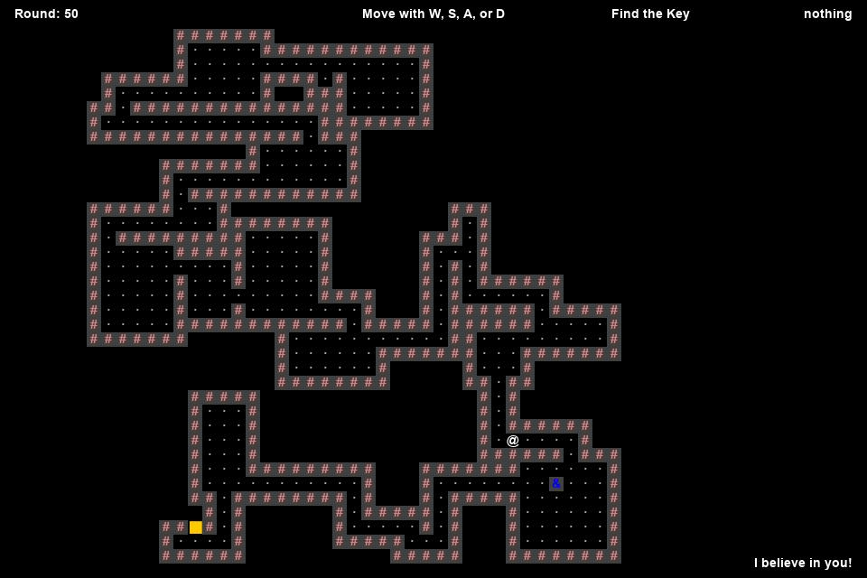

# Build Your Own World project in Java 

### UC Berkeley CS61B Data Structures Spring 2019 final project
*Instructor: Prof. Josh Hug*

[Project Instructions](https://sp19.datastructur.es/materials/proj/proj3/proj3)

Technologies used: **Java, IntelliJ IDE, Git**

### Objective

The goal is to design and implement a 2D tile-based world exploration engine. The project draws inspiration from a popular Nintendo game from the late 1980s, "Zelda II". This is a large design project that requires thoughts on every stage of development from ideation to presentation. There was minimal starter/skeleton code provided to guide with the framework but the rest of implementation was completed on my own using IntelliJ. 

### Features

1. Upon starting the program, users will be prompted with a menu page from which they can initate a new game or load a saved game. 

2. Selecting new game will generate a randomized 2D maze. Players will control an avatar (shown as an @ symbol) with a random starting position which can be controlled using keyboard input (W,S,A,D). The goal is to grab a key (shown as a blue ampersand icon) and head towards the maze exit which is shown as a yellow square.

3. The player is victorious if the avatar retrieves the key and finds the way to the exit.

4. Exiting the program using the command `:Q` will automatically save game progress. The world will be in exactly the same state as it was when returning to the game via the menu screen's "Load Game" option.

### User Interface

The top left of the screen will show the number of rounds that have transpired so far. Each move will increment the round counter by 1. 
The top center of the screen displays instruction to move the character by one square in any direction.
The top right of the screen shows the current objective. It could be to acquire the key or to reach the maze exit. 
Hovering the mouse over the maze will show the identity of.
On the bottom right, random encouragements will be shown to spur the user to make it out of the maze!  

### Running the program

The `byow/Main.java` is the entry point to the program and how the player starts the entire system.

The `byow.Core` package contains the code for the engine which allows the player to interact with the system. 

The `byow.TileEngine` package contains basic methods for rendering and the code structures for tiles.  

This project makes heavy use of `StdDraw`. 

Thank you to Josh Hug and the CS61B for providing access to this wonderful class and projects to the public! 

Go bears!
